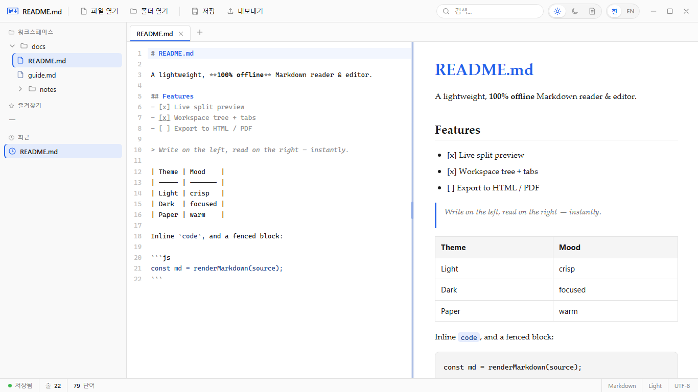
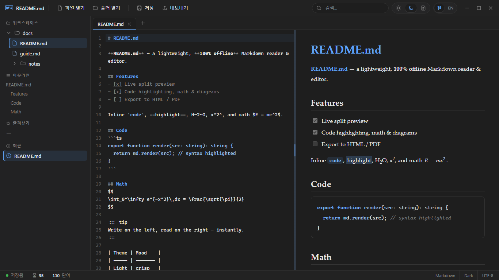
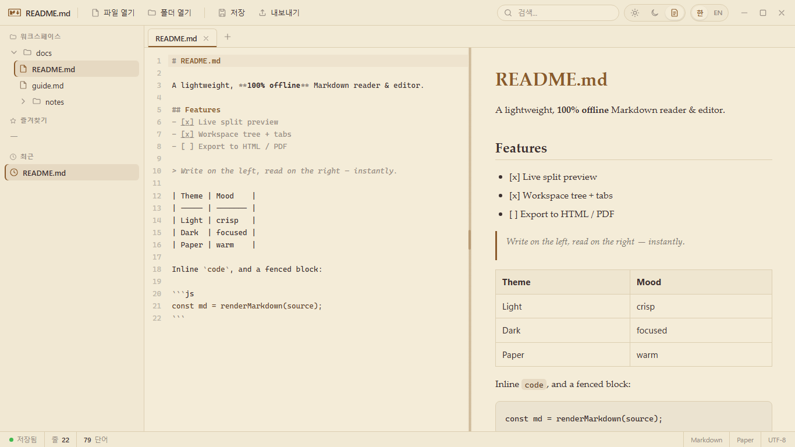

<!-- 티스토리 발행 시 아래 front matter 는 본문에서 지우고, 각 값을 티스토리 입력란(제목·요약글·카테고리·태그)에 직접 넣습니다. -->

---
title: "md 파일 여는 프로그램이 없어서 직접 만들었습니다 — 오프라인 마크다운 에디터 README.md"
description: "메모장으로 열리던 .md 파일이 답답해 직접 만든 Windows 마크다운 에디터 README.md 소개입니다. 실시간 미리보기·Mermaid 다이어그램·KaTeX 수식·전역 검색·HTML/PDF 내보내기를 100% 오프라인으로. Microsoft Store 무료 배포."
date: 2026-07-18
slug: readme-md
category: 개발
tags: [마크다운, 마크다운에디터, 마크다운뷰어, md파일, 윈도우앱, 오프라인, Tauri, MicrosoftStore, 개발일지, README]
keywords: ["md 파일 여는 프로그램", "윈도우 마크다운 에디터 추천", "오프라인 마크다운 뷰어", "마크다운 실시간 미리보기", "마크다운 PDF 변환", "Mermaid 다이어그램 그리기", "무료 마크다운 에디터", "마크다운 문법 미리보기 프로그램"]
---

<!-- 이미지: 레포 docs/deployment/screenshots/*.png (한국어 UI). 티스토리 발행 시 이미지를 업로드하고 경로만 바꾸면 됩니다. -->

# md 파일 여는 프로그램이 없어서 직접 만들었습니다 — 오프라인 마크다운 에디터 README.md

> 메모장으로 열리던 `.md` 파일이 답답해서, 결국 리더를 하나 만든 이야기입니다.

깃허브에서 받은 프로젝트 폴더를 열고 `README.md` 를 더블클릭했더니, 메모장이 떴습니다. `#` 과 `*` 과 백틱이 날것 그대로 박힌 화면. 분명 누군가는 이 문서를 예쁘게 조판된 모습으로 보라고 썼을 텐데, 제 화면에는 기호만 잔뜩이었습니다.

VS Code 를 켜자니 문서 하나 읽자고 IDE 를 부팅하는 게 과했고, 웹 마크다운 에디터는 편했지만 **제 글을 남의 서버에 올려야** 했습니다. 회사 문서든 개인 메모든, 붙여 넣기 전에 한 번씩 손이 멈추더군요.

마땅한 게 없어서 직접 만들었고, 그게 **README.md** 입니다.

## 이름이 곧 사용법입니다 — 앱 이름은 README.md

네, 앱 이름이 `README.md` 입니다. 마크다운이라는 형식을 세상에서 가장 많이 만나게 되는 파일 이름을 그대로 가져왔습니다. 풀어 읽으면 "read me" — 읽어 달라는 뜻이기도 하고요.

솔직히 말하면 여기까지 오는 데 이름을 두 번 갈아엎었습니다. 처음엔 밋밋하게 `md-reader`, 다음엔 한글로 "결". 둘 다 며칠을 못 갔습니다. **설명이 필요한 이름은 이미 진 이름**이라는 생각이 들어서요. `README.md` 는 개발자라면 설명이 필요 없습니다.

대신 대가를 치렀습니다. 이름에 점이 들어간 앱을 만들면 설치 파일 이름부터 꼬이거든요. 그 뒷이야기는 언젠가 따로 쓰겠습니다.

## 왼쪽에 쓰면 오른쪽에 조판됩니다

핵심은 단순합니다. 왼쪽 창에 마크다운을 쓰면, 오른쪽 창에 조판된 문서가 **타이핑하는 즉시** 나타납니다.

그런데 "미리보기"라는 말이 종종 반쪽짜리인 게 문제였습니다. 표는 되는데 각주가 안 되고, 코드는 나오는데 색이 없고, 수식은 아예 포기해야 하는 도구들을 여럿 거쳤습니다. 그래서 이것들을 처음부터 다 넣었습니다.

- **코드 문법 하이라이트** — 언어를 알아서 잡아 색을 입힙니다
- **수식** — `KaTeX` 로 렌더링합니다. LaTeX 문법 그대로 쓰시면 됩니다
- **다이어그램** — `Mermaid` 를 지원합니다. 순서도·ER·클래스·상태·시퀀스 다이어그램을 **글로 써서** 그립니다
- **각주 · 표 · 콜아웃 · 체크리스트** — GitHub 에서 보던 그 모양 그대로

특히 Mermaid 는 제가 가장 아끼는 기능입니다. 다이어그램 툴을 따로 켜지 않고, 문서 안에 `flowchart LR` 한 줄 적고 화살표를 잇는 것만으로 그림이 나옵니다. 그림 파일이 아니라 **글이라서**, 나중에 고치는 것도 한 줄 고치면 끝입니다.

## 인터넷을 아예 쓰지 않습니다 — 100% 오프라인

이 앱은 네트워크를 쓰지 않습니다. 계정도 없고, 로그인도 없고, 분석 SDK 도 없습니다.

"수집하지 않습니다"라고 말로만 하는 건 저도 여러 번 봤습니다. 그래서 **말 대신 구조로 막았습니다.** 앱에 하드닝된 `CSP` 를 걸어서 원격 `http`·`https` 요청 자체를 차단해 뒀습니다. 제가 나중에 마음이 바뀌어 추적 코드를 넣고 싶어도, 그 요청이 앱 밖으로 나가지 못합니다.

문서를 열고, 읽고, 쓰고, 내보내는 모든 과정이 **당신의 디스크 안에서만** 일어납니다. 그리고 그렇게 쓴 글의 모든 권리는 당신 것입니다 — 개인이든 업무든, 상업적으로 쓰셔도 됩니다.

## 흩어진 문서를 한자리에 — 워크스페이스

문서가 두세 개일 땐 아무 도구나 괜찮습니다. 문제는 서른 개가 넘어가면서부터죠.

폴더를 통째로 열면 왼쪽에 트리가 뜨고, 탭으로 여러 파일을 동시에 열어 둘 수 있습니다. 여기까진 흔한 이야기입니다. 제가 정말 필요했던 건 그다음이었습니다.

- **가상 폴더** — 디스크 여기저기 흩어진 문서를 **원본은 그대로 둔 채** 드래그해서 제가 원하는 구조로 묶습니다. 프로젝트 A 의 설계서와 프로젝트 B 의 회의록을 한 폴더에 나란히 두는 식으로요
- **전역 전문검색** — 워크스페이스 전체에서 본문을 검색합니다. 파일 이름이 아니라 **내용**을요
- **전역 찾기·바꾸기** — 정규식을 지원하고, 바꾸기 전에 파일별로 미리 보고 고를 수 있습니다
- **명령 팔레트 `Ctrl+Shift+P` · 퀵오픈 `Ctrl+P`** — 손을 키보드에서 떼지 않아도 됩니다
- **아웃라인 · 즐겨찾기** — 긴 문서 안에서 길을 잃지 않도록

## 다 쓴 문서는 파일 하나로 — HTML·PDF 내보내기

다 쓴 다음이 늘 문제였습니다. 마크다운 파일을 그대로 보내면 상대방도 마크다운 뷰어가 있어야 하니까요.

그래서 **자기완결 HTML** 로 내보냅니다. 이미지도, 폰트도 파일 안에 통째로 박아 넣어서 **`.html` 파일 하나만 보내면** 상대방 브라우저에서 제가 본 그대로 열립니다. 이미지 폴더를 같이 압축해 보낼 필요가 없습니다. `PDF` 로도 저장할 수 있고요.

읽는 환경도 여러 갈래로 준비했습니다. 에디터를 접고 문서에만 집중하는 **리딩 모드**, 문서를 그대로 슬라이드로 띄우는 **프레젠테이션 모드**, 그리고 눈이 편한 쪽으로 고르는 **라이트·다크·페이퍼** 세 가지 테마.

페이퍼 테마는 종이 질감을 흉내 낸 것인데, 만들 땐 반쯤 장난이었다가 지금은 제가 가장 오래 켜 두는 테마가 됐습니다.

## 설치하기

`Microsoft Store` 에서 무료로 받으실 수 있습니다. 게시자는 **SlnU**, Windows 10 이상이면 동작합니다. 설치하면 `.md`·`.markdown` 파일이 자동으로 연결되니, 그다음부터는 그냥 더블클릭하시면 됩니다.

  <a href="https://apps.microsoft.com/detail/9N9QMXQPND3H?hl=ko-kr&gl=KR&ocid=pdpshare"><strong>▶ Microsoft Store 에서 README.md 설치하기</strong></a>

이제 `README.md` 를 더블클릭하면, 메모장 대신 읽으라고 쓰인 그 문서가 열립니다.
