# Mermaid 갤러리 · Mermaid Gallery

> 회귀 검증용 샘플 — 모든 다이어그램이 렌더되어야 정상. / Regression fixture — every diagram must render.
> mermaid 11 문법 기준. 하나라도 "mermaid render error" 또는 빈 블록이면 버그.

## 1. Flowchart

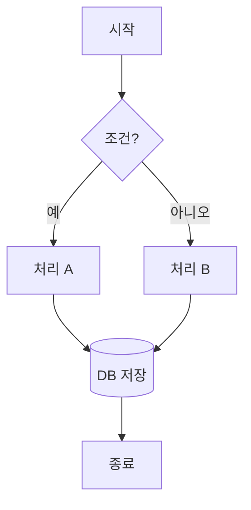

## 2. ER Diagram

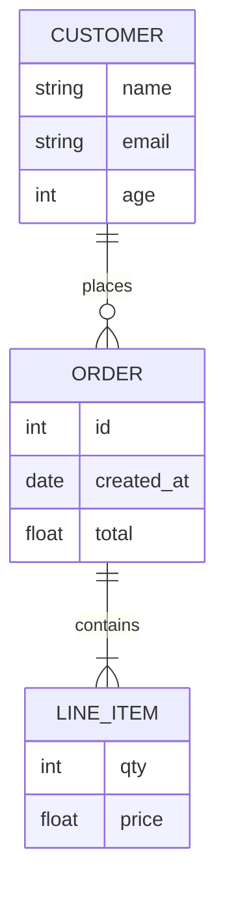

## 3. Sequence Diagram

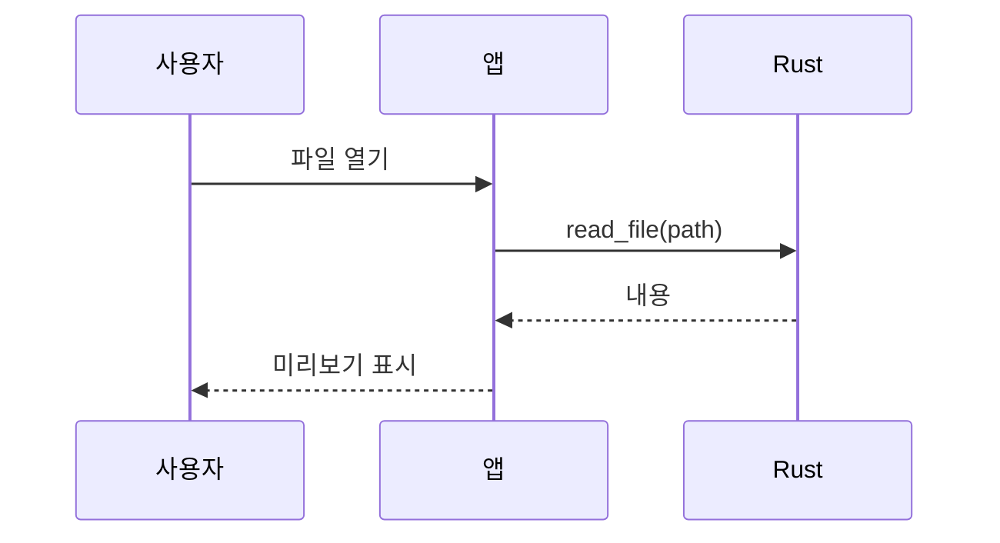

## 4. Class Diagram

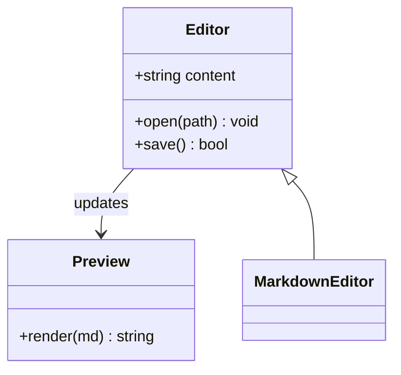

## 5. State Diagram (v2)

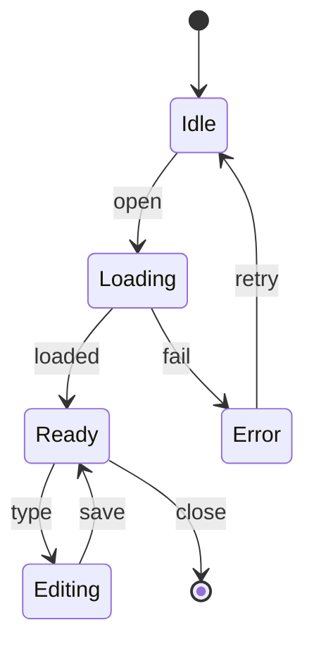

## 6. Gantt

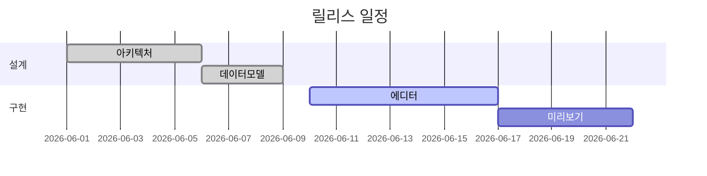

## 7. Pie

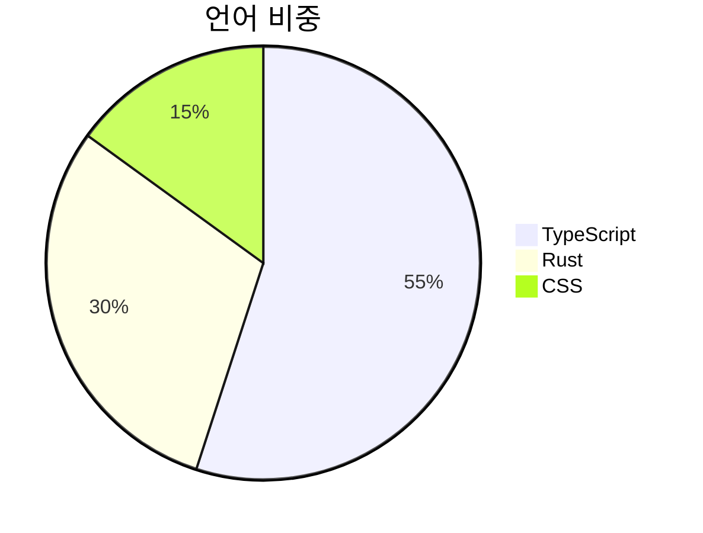

## 8. Git Graph

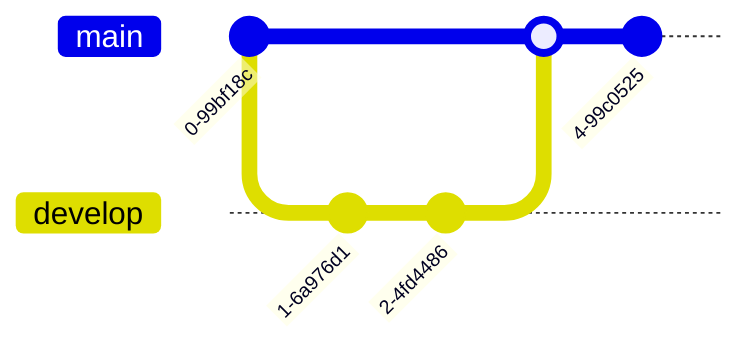

## 9. User Journey

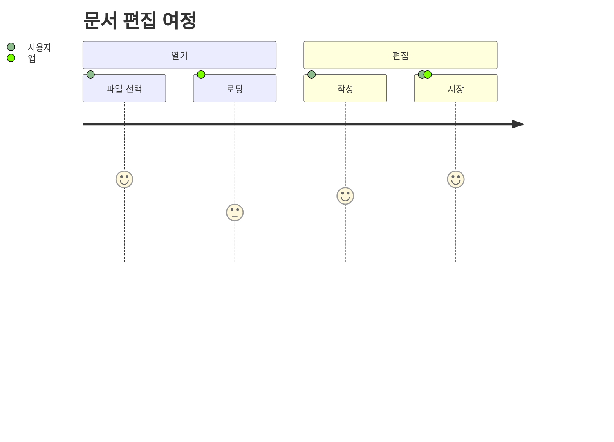

## 10. Mindmap

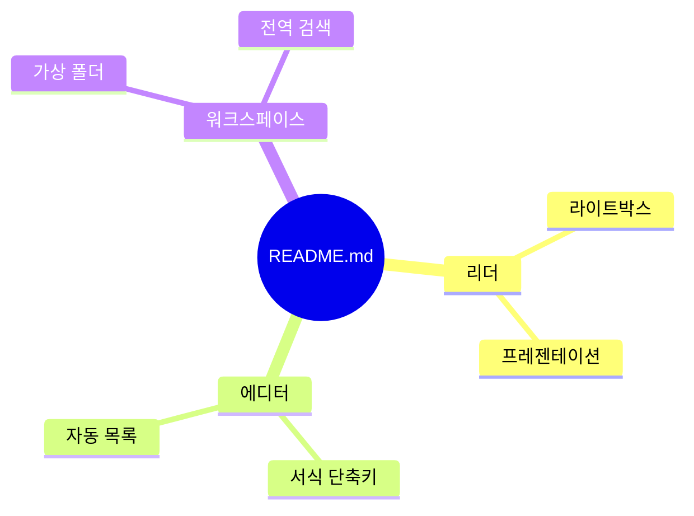

## 11. Timeline

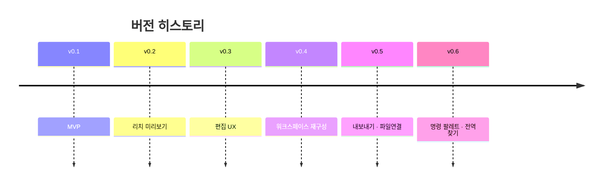

## 12. Quadrant Chart

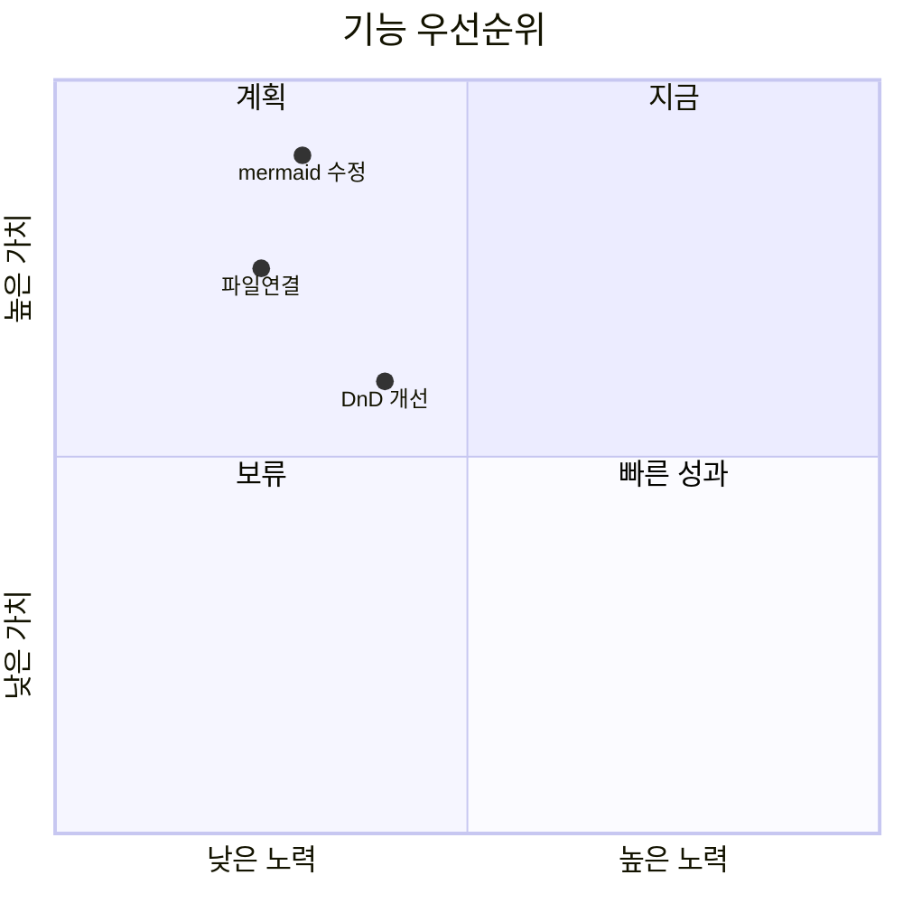
