# Mermaid 갤러리 · Mermaid Gallery

> 회귀 검증용 샘플 — 모든 다이어그램이 렌더되어야 정상. / Regression fixture — every diagram must render.
> mermaid 11 문법 기준. 하나라도 "mermaid render error" 또는 빈 블록이면 버그.
> **예외: 18번은 고의로 문법이 깨진 블록**이다(오류 표면화 경로 검증) — 여기서만 오류 메시지가 정상이다.
>
> 라벨이 도형 안에 들어가는지 보는 픽스처는 두 축이다 — **세로**(줄높이·수직정렬) 13·14·16,
> **가로**(라벨 폭) 1·2·13·15·17. 측정은 앱 문서, 표시는 미리보기 문서에서 일어나므로 두 문맥이
> 어긋나면 글자가 도형을 넘거나(세로) **글자 중간에서 잘린다**(가로) — 그 증상이 보이면 버그.
>
> `cd src; npm run probe:mermaid` 가 **이 파일을 그대로 읽어** 기계적으로 검사한다. 여기에
> 다이어그램을 추가하면 프로브 커버리지도 함께 늘어난다.

## 1. Flowchart

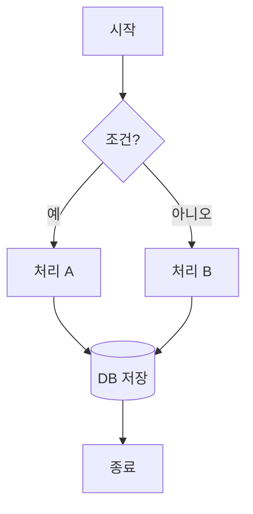
```mermaid
flowchart TD
    A[시작] --> B{조건?}
    B -->|예| C[처리 A]
    B -->|아니오| D[처리 B]
    C --> E[(DB 저장)]
    D --> E
    E --> F[종료]
```

## 2. ER Diagram

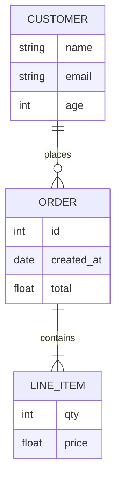
```mermaid
erDiagram
    CUSTOMER ||--o{ ORDER : places
    ORDER ||--|{ LINE_ITEM : contains
    CUSTOMER {
        string name
        string email
        int age
    }
    ORDER {
        int id
        date created_at
        float total
    }
    LINE_ITEM {
        int qty
        float price
    }
```

## 3. Sequence Diagram

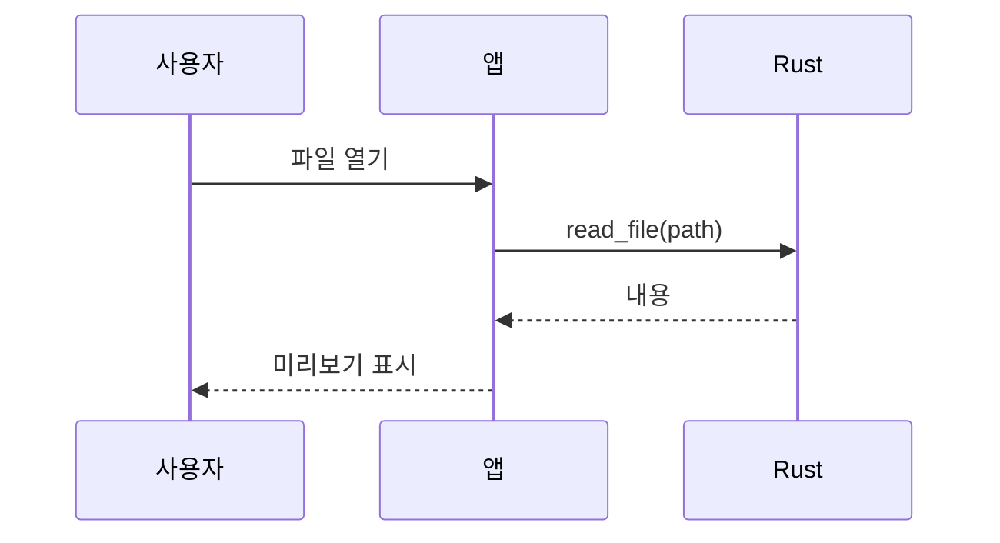
```mermaid
sequenceDiagram
    participant U as 사용자
    participant A as 앱
    participant R as Rust
    U->>A: 파일 열기
    A->>R: read_file(path)
    R-->>A: 내용
    A-->>U: 미리보기 표시
```

## 4. Class Diagram

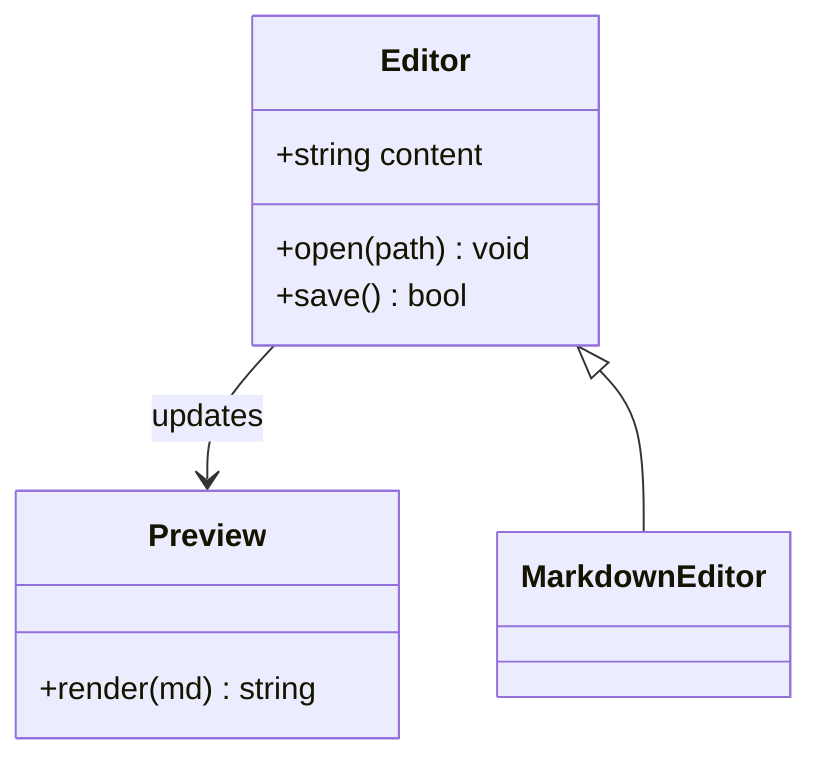
```mermaid
classDiagram
    class Editor {
        +string content
        +open(path) void
        +save() bool
    }
    class Preview {
        +render(md) string
    }
    Editor --> Preview : updates
    Editor <|-- MarkdownEditor
```

## 5. State Diagram (v2)

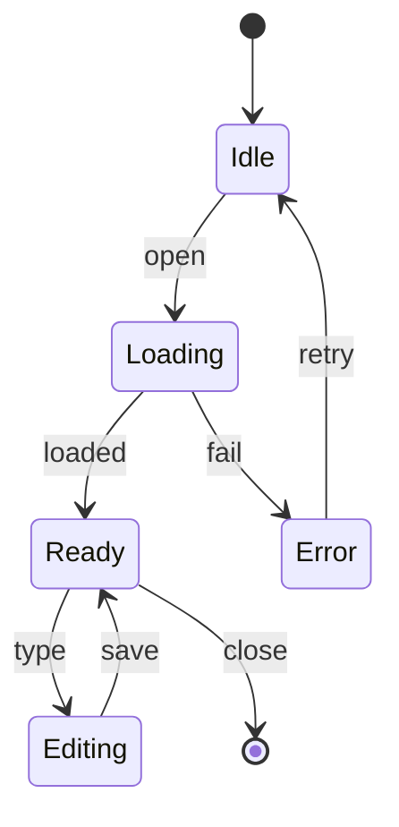
```mermaid
stateDiagram-v2
    [*] --> Idle
    Idle --> Loading : open
    Loading --> Ready : loaded
    Loading --> Error : fail
    Ready --> Editing : type
    Editing --> Ready : save
    Error --> Idle : retry
    Ready --> [*] : close
```

## 6. Gantt

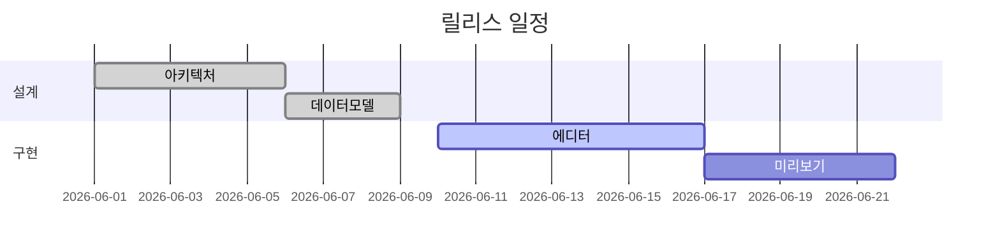
```mermaid
gantt
    title 릴리스 일정
    dateFormat YYYY-MM-DD
    section 설계
    아키텍처       :done,    des1, 2026-06-01, 5d
    데이터모델     :done,    des2, after des1, 3d
    section 구현
    에디터         :active,  imp1, 2026-06-10, 7d
    미리보기       :         imp2, after imp1, 5d
```

## 7. Pie

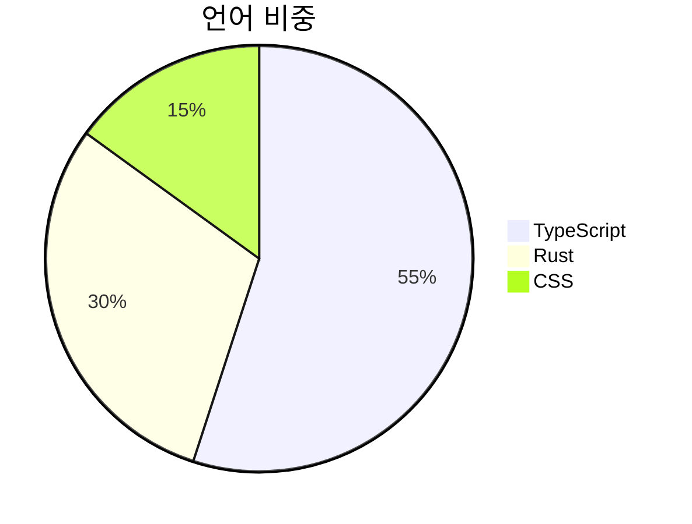
```mermaid
pie title 언어 비중
    "TypeScript" : 55
    "Rust" : 30
    "CSS" : 15
```

## 8. Git Graph

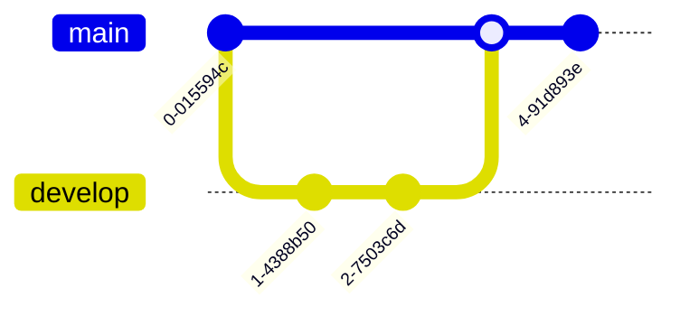
```mermaid
gitGraph
    commit
    branch develop
    checkout develop
    commit
    commit
    checkout main
    merge develop
    commit
```

## 9. User Journey

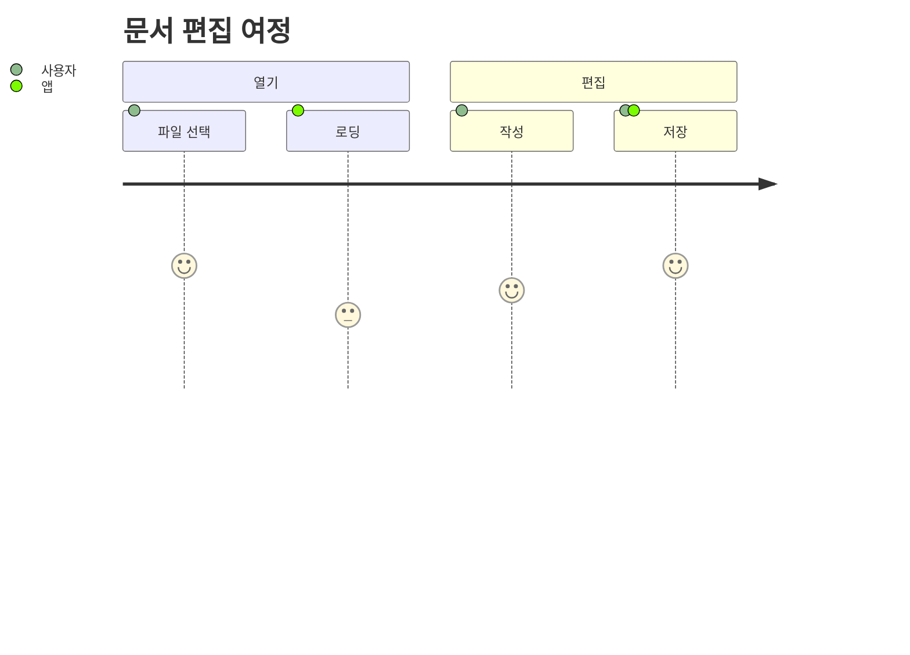
```mermaid
journey
    title 문서 편집 여정
    section 열기
      파일 선택: 5: 사용자
      로딩: 3: 앱
    section 편집
      작성: 4: 사용자
      저장: 5: 사용자, 앱
```

## 10. Mindmap

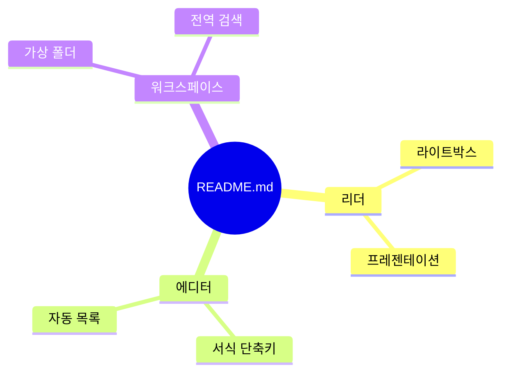
```mermaid
mindmap
  root((README.md))
    리더
      라이트박스
      프레젠테이션
    에디터
      서식 단축키
      자동 목록
    워크스페이스
      가상 폴더
      전역 검색
```

## 11. Timeline

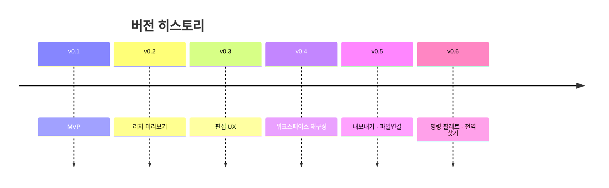
```mermaid
timeline
    title 버전 히스토리
    v0.1 : MVP
    v0.2 : 리치 미리보기
    v0.3 : 편집 UX
    v0.4 : 워크스페이스 재구성
    v0.5 : 내보내기 · 파일연결
    v0.6 : 명령 팔레트 · 전역 찾기
```

## 12. Quadrant Chart

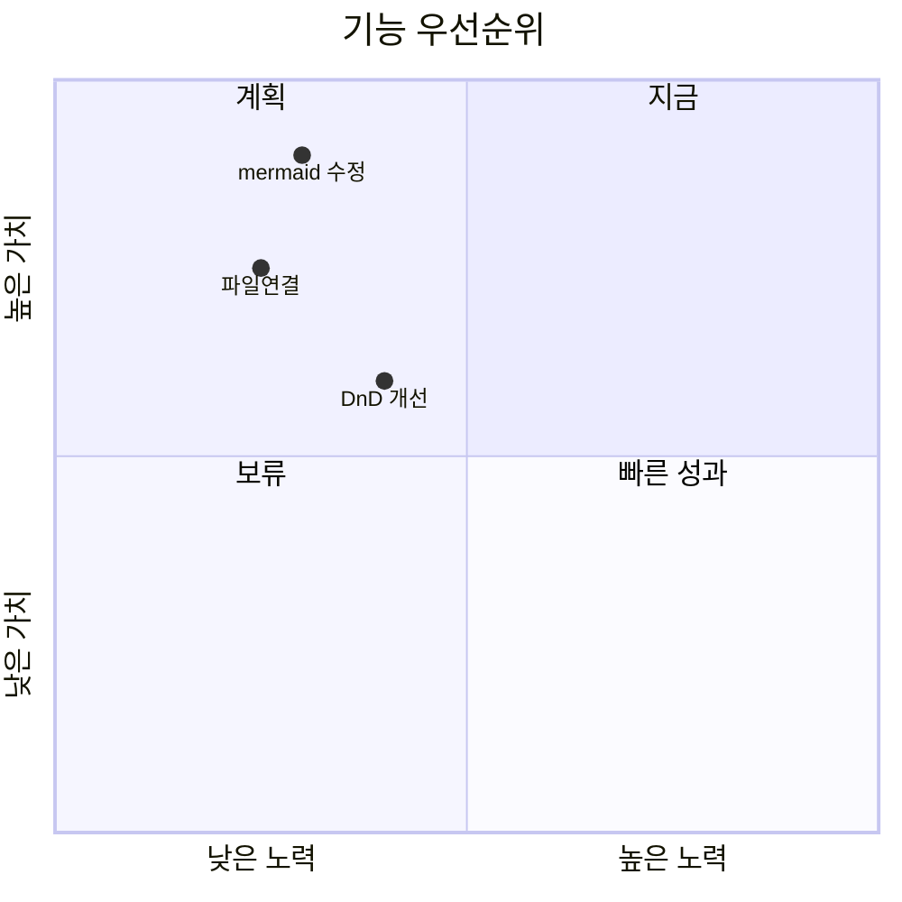
```mermaid
quadrantChart
    title 기능 우선순위
    x-axis 낮은 노력 --> 높은 노력
    y-axis 낮은 가치 --> 높은 가치
    quadrant-1 지금
    quadrant-2 계획
    quadrant-3 보류
    quadrant-4 빠른 성과
    mermaid 수정: [0.3, 0.9]
    파일연결: [0.25, 0.75]
    DnD 개선: [0.4, 0.6]
```

## 13. 긴 한글 라벨 (한글 글리프 폭 측정)

mermaid 기본 글꼴 스택에는 한글 글리프가 없어 한글은 폴백 face로 그려진다. 측정 문서와 표시 문서가
서로 다른 face를 고르면 **라벨이 도형을 넘친다.** 라벨이 상자 안에 들어오는지 본다.

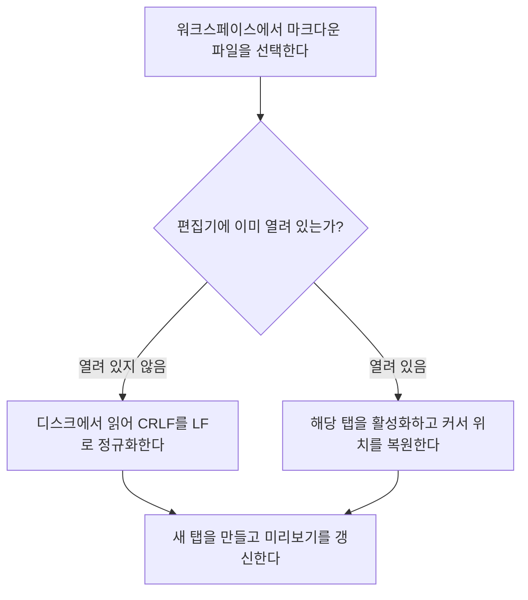
```mermaid
flowchart TD
    A[워크스페이스에서 마크다운 파일을 선택한다] --> B{편집기에 이미 열려 있는가?}
    B -->|열려 있음| C[해당 탭을 활성화하고 커서 위치를 복원한다]
    B -->|열려 있지 않음| D[디스크에서 읽어 CRLF를 LF로 정규화한다]
    D --> E[새 탭을 만들고 미리보기를 갱신한다]
    C --> E
```

## 14. 다행 라벨 + 노트 (line-height 상속)

` ` 라벨과 노트 박스는 여러 줄이라 줄높이 차이가 그대로 높이 오차가 된다. 미리보기 본문은
`line-height:1.75`인데 측정 문맥이 `normal`이면 라벨이 상자보다 높아져 **아래가 잘린다.**

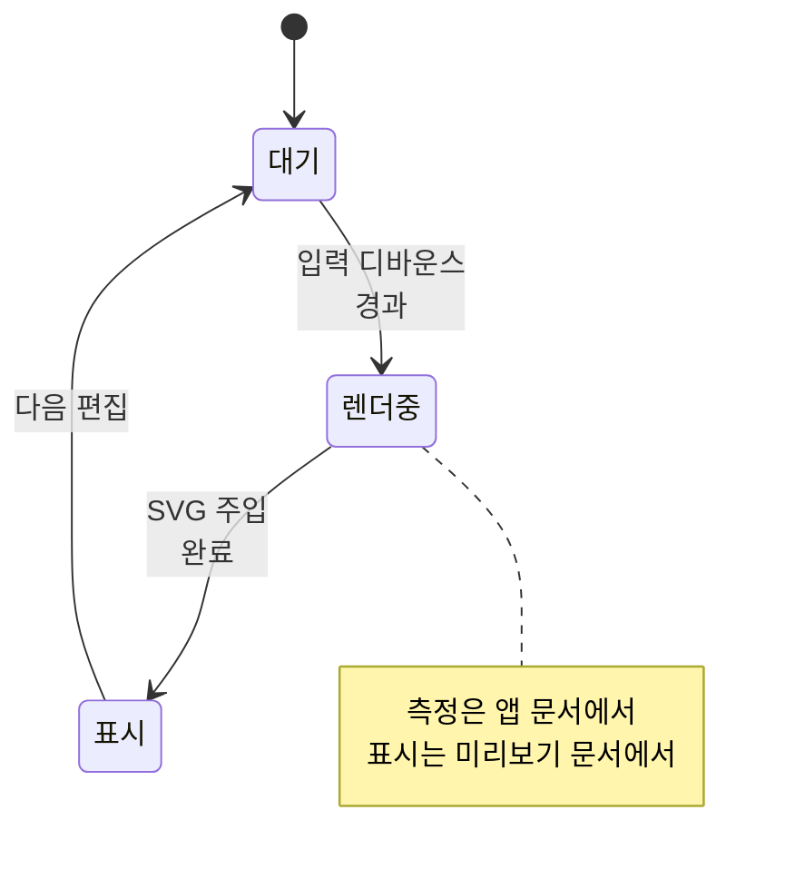
```mermaid
stateDiagram-v2
    [*] --> 대기
    대기 --> 렌더중 : 입력 디바운스<br/>경과
    렌더중 --> 표시 : SVG 주입<br/>완료
    표시 --> 대기 : 다음 편집
    note right of 렌더중
        측정은 앱 문서에서
        표시는 미리보기 문서에서
    end note
```

## 15. 와이드 다이어그램 (맞춤 / 원본)

설정 → **다이어그램 너비**를 `맞춤`↔`원본`으로 바꿔가며 본다. 맞춤은 카드 폭에 축소되고,
원본은 실제 크기로 그려지며 블록 안에서 가로 스크롤된다(왼쪽 끝까지 닿아야 한다).

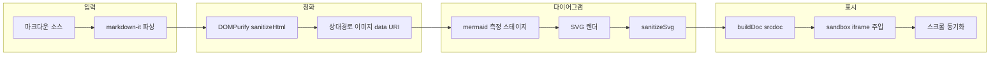
```mermaid
flowchart LR
    subgraph 입력
        A[마크다운 소스] --> B[markdown-it 파싱]
    end
    subgraph 정화
        B --> C[DOMPurify sanitizeHtml] --> D[상대경로 이미지 data URI]
    end
    subgraph 다이어그램
        D --> E[mermaid 측정 스테이지] --> F[SVG 렌더] --> G[sanitizeSvg]
    end
    subgraph 표시
        G --> H[buildDoc srcdoc] --> I[sandbox iframe 주입] --> J[스크롤 동기화]
    end
```

## 16. XY Chart (dominant-baseline 수직정렬)

축 라벨·데이터 라벨이 `dominant-baseline`으로 수직 중앙정렬된다. 이 속성이 정화에서 지워지면
글자가 baseline으로 내려앉아 축 밖으로 밀린다. 12번 Quadrant Chart와 함께 본다.

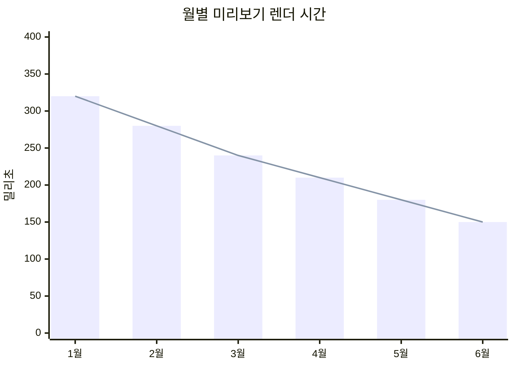
```mermaid
xychart-beta
    title "월별 미리보기 렌더 시간"
    x-axis ["1월", "2월", "3월", "4월", "5월", "6월"]
    y-axis "밀리초" 0 --> 400
    bar [320, 280, 240, 210, 180, 150]
    line [320, 280, 240, 210, 180, 150]
```

## 17. 가로 라벨 폭 (라벨 상자 얼어붙음)

라벨을 재는 곳(앱 문서)과 그리는 곳(미리보기 문서)이 다르므로, 폭이 어긋나면 글자가 **글자 중간에서
가로로 잘린다** — 아래가 잘리는 14번의 세로 증상과 다르다. v0.6.8에서 실제로 났고, 원인이 두 겹이었다:
mermaid가 노드 라벨을 `<foreignObject>` HTML로 내면서 **앱 문서에서 잰 폭을 상자에 얼려 넣은 것**과,
그 앱 문서의 `.node{font-size:13px}`(워크스페이스 트리 행)가 다이어그램 라벨에 걸린 것.

아래 라벨은 모두 **한 줄**이며 마지막 글자까지 보여야 한다 — **`끝.` 과 `END.` 가 안 보이면 버그다.**

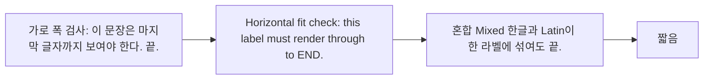
```mermaid
flowchart LR
    A[가로 폭 검사: 이 문장은 마지막 글자까지 보여야 한다. 끝.] --> B[Horizontal fit check: this label must render through to END.]
    B --> C[혼합 Mixed 한글과 Latin이 한 라벨에 섞여도 끝.]
    C --> D[짧음]
```

## 18. 고의 문법 오류 (오류 표면화 — 이 블록만 오류가 정상)

**아래는 일부러 깨뜨린 블록이다. 고치지 말 것.** 빈 블록이 아니라 붉은 오류 메시지가 보여야 정상이며,
아무것도 안 보이거나 조용히 사라지면 `.mermaid-error` 경로가 깨진 것이다.

```mermaid
flowchart TD
    A[미완성 노드 --> B{닫히지 않은 중괄호
```
